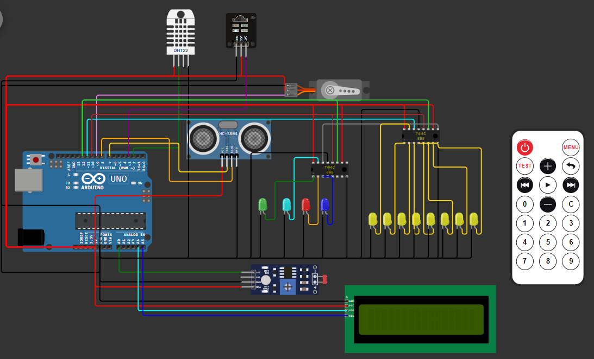
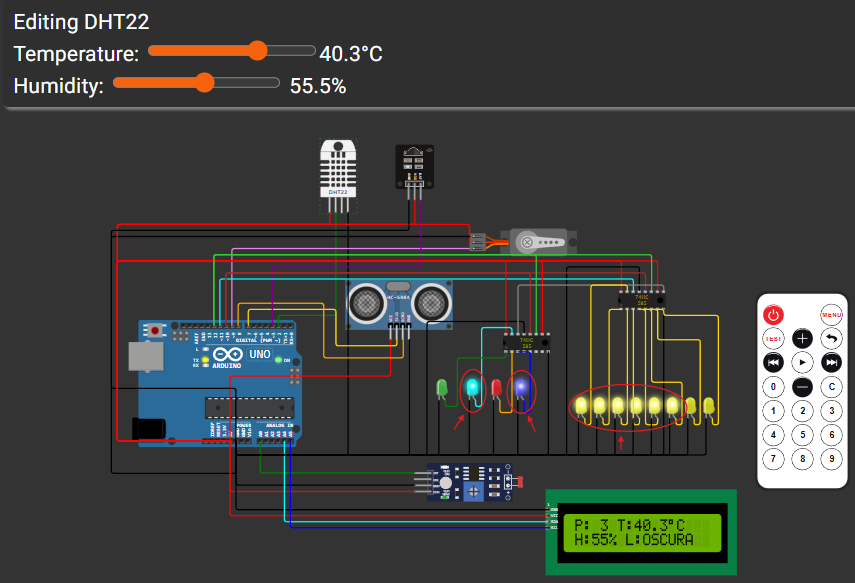
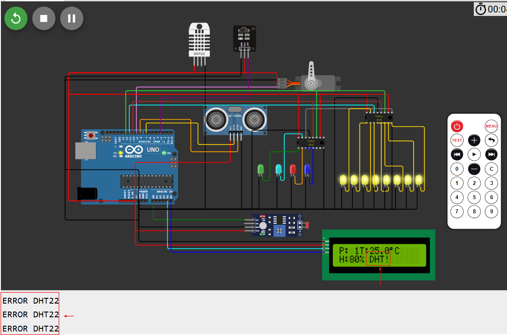

# Sistema Inteligente de Control de Ascensor ACME S.A.
## Descripción 
Sistema de control de un ascensor industrial de cinco plantas implementado en Arduino UNO y simulado en Wokwi.
El sistema integra:
- Control remoto por infrarrojos
- Medición de temperatura y humedad
- Control de iluminación automática
- Detección de presencia
- Visualización mediante LCD
- Simulación del movimiento del ascensor mediante servomotor
- Autodiagnóstico de sensores-Arquitectura del sistema

 ## Arquitectura del sistema
 La arquitectura del sistema se incluye en el archivo "diagram.json" de Wokwi y se muestra en la siguiente imagen.
 
 
 
## BOM
A continuación se listan los diferentes componentes utilizados en el sistema.

| Componente       | Código      | Cantidad |
| ---------------- | ----------- | -------- |
| Arduino UNO      | A000066     | 1        |
| DHT22            | AM2302      | 1        |
| HC-SR04          | HC-SR04     | 1        |
| LDR              | LDR         | 1        |
| LCD I2C 16x2     | PCF8574     | 1        |
| Servo SG90       | SG90        | 1        |
| Receptor IR      | VS1838B     | 1        |
| Registro         | 74HC595     | 2        |
| LEDs             | LED 5mm     | 20       |

## Funcionamiento
### Control del ascensor
El usuario selecciona una planta mediante un mando infrarrojo, el receptor recibe ese código y le transmite al servomotor la posición en la que debe colocarse, que simulará las diferentes plantas en las que se puede encontrar el ascensor. El botón del mando y su equivalencia en

| Botón | Planta   | Posición Servo |
| ----- | -------- | -------------- |
| 1     | Planta 1 | 0º             |
| 2     | Planta 2 | 45º            |
| 3     | Planta 3 | 90º            |
| 4     | Planta 4 | 135º           |
| 5     | Planta 5 | 180º           |

### Monitorización ambiental
El sensor DHT22 mide temperatura y humedad y el sistema compara las medidas con los límites establecidos:
- Temperatura: 25 ºC
- Humedad: 80 %
Para temperaturas y humedad inferiores o superiores a estos valores (teniendo en cuenta un margen), se encenderán los 4 LEDs que simulan una climatización/humidificación del ascensor; es decir, la respuesta que tendrían que dar los actuadores del sistema según los valores medidos por el sensor DHT22.

### Control de iluminación
La iluminación se regula mediante un conjunto de LEDs gestionado por registros 74HC595; estos se encienden en mayor cantidad cuanta menos luz ambiental se detecte a través de un sensor LDR.

### Detección de presencia
Se utiliza un sensor ultrasónico que calcula la distancia a la que hay una presencia a partir del tiempo que tarda en rebotar un sonido.

### Interfaz IHM
EL funcionamiento descrito anteriormente se mostrará de manera amigable al usuario a través de un sensor LCD, que mostrará en pantalla las condiciones ambientales medidas y la planta actual en la que se encuentra el ascensor.
Además, se sacará la información recogida por los sensores a través del puerto serie del Arduino.

## Diagrama de flujo
Inicio
  |
Leer sensores
  |
Calcular clima
  |
Actualizar LEDs
  |
Detectar presencia
  |
¿IR recibido?
  |
Sí --> Mover ascensor
  |
Actualizar LCD
  |
Repetir

## Mejoras implementadas
En la Actividad 3 se han implementado las siguientes mejoras:
- Control remoto mediante infrarrojos.
- Ajuste remoto de setpoints.
- Autodiagnóstico de sensores.
- Optimización del refresco LCD.
- Almacenamiento persistente mediante EEPROM.

## Resultados
A continuación se muestran las capturas con el funcionamiento del ascensor y la respuesta ante posibles fallos:
- **Cambio de planta tras seleccionar el 3 en el mando IR:**  
  El sistema permite controlar la posición del ascensor mediante un mando a distancia por infrarrojos. Al pulsar un número en el mando, el Arduino decodifica la señal y envía la orden al servomotor para que gire al ángulo correspondiente a esa planta. Simultáneamente, la pantalla LCD se actualiza para mostrar la nueva ubicación. En las siguientes imágenes se aprecia el estado inicial en la Planta 1 (ángulo 0º) y el cambio a la Planta 3 (ángulo 90º) tras pulsar el botón "3".
    
    
    
    

- **LEDs encendidos tras la medición de unas condiciones ambientales:**

- **Errores de medida en los sensores:**

## Código Wokwi de la simulación
[Proyecto Wokwi](https://wokwi.com/projects/465466016252439553)

## Vídeo demostración
[Vídeo demostración](videos/MUINTEL_Instrumentacion_Act3_G36.mp4)
